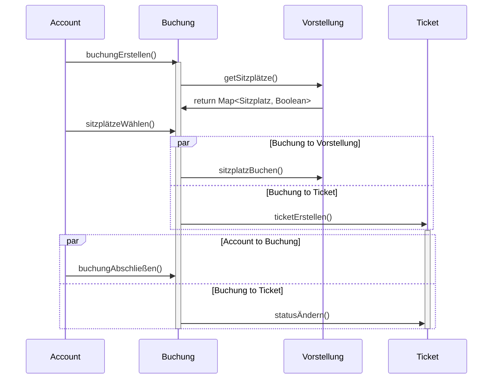

```mermaid
sequenceDiagram
    Account->>Buchung: buchungErstellen()
    activate Buchung
    Buchung->>Vorstellung: getSitzplätze()
    Vorstellung->>Buchung: return Map<Sitzplatz, Boolean>
    Account->>Buchung: sitzplätzeWählen()
    par Buchung to Vorstellung
    Buchung->>Vorstellung: sitzplatzBuchen()
    and Buchung to Ticket
    Buchung->>Ticket: ticketErstellen()
    end
    activate Ticket
    par Account to Buchung
    Account->>Buchung: buchungAbschließen()
    and Buchung to Ticket
    Buchung->>Ticket: statusÄndern()
    end
    deactivate Ticket
    deactivate Buchung
```
